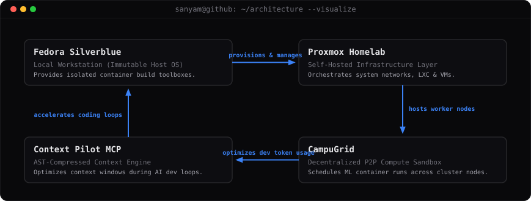

# Sanyam Ahuja

**Computer Engineering Student @ Thapar Institute**  
*Backend • Systems • Infrastructure*

I'm currently working on TIET's accreditation platform while spending most of my free time building developer tools, experimenting with distributed systems, and slowly turning my homelab into a playground for learning infrastructure.

---

### Currently thinking about

* [Can idle consumer GPUs become a useful compute marketplace?](https://github.com/Sanyam-Ahuja/CampusGrid)
* [Can AI agents decide what should leave context?](https://github.com/Sanyam-Ahuja/context-pilot-mcp)
* [How do you turn a manual accreditation workflow into maintainable software?](https://github.com/Sanyam-Ahuja/OBE)

---

### Current Focus

#### Currently Building
* **CampusGrid** — Distributed peer-to-peer GPU compute marketplace.
* **context-pilot-mcp** — AST-compressing Model Context Protocol server.
* **Portfolio** — Handcrafted engineering notebook and system dashboard.
* **OBE Platform** — University-wide accreditation platform for academic audits.

#### Currently Learning
* Distributed Systems
* Linux Internals
* Databases
* Platform Engineering

#### Currently Reading
* *Designing Data-Intensive Applications* (DDIA) by Martin Kleppmann
* *Operating Systems: Three Easy Pieces* (OSTEP) by Remzi H. Arpaci-Dusseau & Andrea C. Arpaci-Dusseau

---

### Outside of Coursework

Most evenings you'll probably find me:
* **Rebuilding** my homelab
* **Experimenting** with Proxmox
* **Breaking** Fedora Silverblue
* **Reading** *Designing Data-Intensive Applications* (DDIA)
* **Writing** about systems on my [portfolio notes](https://sanyam-ahuja.github.io)

---

### Featured Projects

#### [CampusGrid](https://github.com/Sanyam-Ahuja/CampusGrid)
A decentralized GPU compute marketplace designed to schedule and sandbox machine learning model training runs across untrusted consumer host machines.
* **Engineering Challenge:** How do you securely run arbitrary user containers on untrusted consumer machines without root privileges, while still scheduling workloads efficiently?

#### [OBE Platform](https://github.com/Sanyam-Ahuja/OBE)
The backend database aggregation matrix engine powering Thapar's academic accreditation workflow for 15,000+ students.
* **Engineering Challenge:** How do you turn a complex, manual institutional accreditation spreadsheet matrix into a highly performant software system, handling 15,000+ student data points with nested relational aggregates under concurrent access?

#### [context-pilot-mcp](https://github.com/Sanyam-Ahuja/context-pilot-mcp)
An open-source AST-aware developer CLI and MCP server (published on PyPI) that prunes source code context for AI coding agents.
* **Engineering Challenge:** How can we reduce context window pressure for AI agents by building an AST-based compressor that strips function bodies while preserving structural declarations?

#### [Snapshoty](https://github.com/Sanyam-Ahuja/Snapshoty)
An AI-powered screenshot knowledge system that transforms screenshots into searchable documentation with semantic extraction and auto-categorization.
* **Engineering Challenge:** How do we build a semantic query engine that goes beyond basic OCR to understand layout, UI context, and text elements in screenshot streams?

#### [Her Voice](https://github.com/Sanyam-Ahuja/Her-Voice)
A geohash-indexed women safety routing and safety scoring application that runs spatial queries on PostGIS.
* **Engineering Challenge:** How do we perform high-frequency spatial queries and safety-score routing using geohashed points in PostGIS without stalling the database connection pool or backend event loop?

---

### Engineering Interests

* **Execution environments** (namespaces, cgroups, rootless container building)
* **Resource isolation** (sandboxing untrusted workloads, microVMs)
* **Distributed systems** (scheduling, remote execution, P2P networks)
* **Developer tooling** (AST parsers, context managers, CLI automation)
* **Database performance** (query optimization, complex matrix aggregation, caching)
* **Infrastructure** (Proxmox homelabs, virtualization, self-hosted services)

---

### Latest Writing

<!-- LATEST_WRITING_START -->
* [Why I Daily-Drive Fedora Silverblue](https://sanyam-ahuja.github.io/notes/fedora-silverblue)
* [My Homelab Was Never About Watching Movies](https://sanyam-ahuja.github.io/notes/homelab-movies)
* [Why Tree-Sitter Uses Byte Offsets](https://sanyam-ahuja.github.io/notes/tree-sitter-byte-offsets)
<!-- LATEST_WRITING_END -->

---

### GitHub Activity

#### Latest Commits
<!-- RECENT_COMMITS_START -->
* **Her-Voice** [`836a495`](https://github.com/Sanyam-Ahuja/Her-Voice/commit/836a4952b0a6fc4743c2f5515d75782289f0ef3c) — add README.md and update gitignore
* **Her-Voice** [`7973439`](https://github.com/Sanyam-Ahuja/Her-Voice/commit/7973439cb1822ad3fc273fc91a8270a9ba9f025f) — feat: add Geography custom SQLAlchemy type and update location column to support PostGIS points
* **Her-Voice** [`0f65b1b`](https://github.com/Sanyam-Ahuja/Her-Voice/commit/0f65b1b0e083fd02ab0228a08090674e754babbf) — fix UUID NameError in models.py by importing it correctly at the top
* **Her-Voice** [`120f0f8`](https://github.com/Sanyam-Ahuja/Her-Voice/commit/120f0f8a4fe33b13a325598bd5ef0ad33bde368c) — add location permissions and EAS project configuration to app manifest
* **Her-Voice** [`0ea29ad`](https://github.com/Sanyam-Ahuja/Her-Voice/commit/0ea29ad4461695b14e6868b047c5108bedbfd995) — import models inside main.py to register tables with SQLAlchemy metadata on startup
<!-- RECENT_COMMITS_END -->

#### Recently Updated Repositories
<!-- RECENT_REPOS_START -->
* **[CampussGrid](https://github.com/Sanyam-Ahuja/CampussGrid)** (*TypeScript*)
* **[AgenticGIthub](https://github.com/Sanyam-Ahuja/AgenticGIthub)** (*Python*)
* **[Python-Old-Practice](https://github.com/Sanyam-Ahuja/Python-Old-Practice)** (*Python*)
* **[Her-Voice](https://github.com/Sanyam-Ahuja/Her-Voice)** (*Python*)
* **[Sample-e-commerce-website](https://github.com/Sanyam-Ahuja/Sample-e-commerce-website)** — Anyone who know MERN stack can modify the components (*JavaScript*)
<!-- RECENT_REPOS_END -->

---

### Navigation

* **Portfolio:** [sanyam-ahuja.github.io](https://sanyam-ahuja.github.io)
* **LinkedIn:** [sanyam-ahuja-tiet](https://www.linkedin.com/in/sanyam-ahuja-tiet/)
* **Email:** [s.ahuja.alwar@gmail.com](mailto:s.ahuja.alwar@gmail.com)
