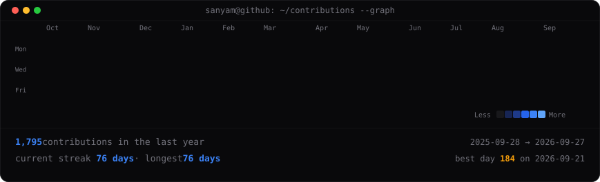

# Sanyam Ahuja

Computer Engineering student at Thapar Institute.

Software Developer Intern at TIET, building the university's accreditation platform.

I enjoy building backend systems, developer tooling, and distributed systems while spending an unhealthy amount of time breaking things in my homelab to understand how they actually work.

---

### Currently
* Building [Context Pilot MCP](https://github.com/Sanyam-Ahuja/context-pilot-mcp)
* Designing [CampusGrid](https://github.com/Sanyam-Ahuja/CampusGrid)
* Maintaining my Proxmox homelab
* Learning operating systems and distributed systems

---

### Where to Click

* **Portfolio:** [sahuja.in](https://sahuja.in)
* **LinkedIn:** [sanyam-ahuja-tiet](https://www.linkedin.com/in/sanyam-ahuja-tiet/)
* **Email:** [s.ahuja.alwar@gmail.com](mailto:s.ahuja.alwar@gmail.com)

#### Featured Repositories
* **[context-pilot-mcp](https://github.com/Sanyam-Ahuja/context-pilot-mcp)** — AST-aware coding agent context pruner.
* **[CampusGrid](https://github.com/Sanyam-Ahuja/CampusGrid)** — Distributed peer-to-peer GPU compute marketplace.
* **[AgenticGIthub](https://github.com/Sanyam-Ahuja/AgenticGIthub)** — Orchestrated autonomous software engineering pipeline.
* **[Her-Voice](https://github.com/Sanyam-Ahuja/Her-Voice)** — Geohash-indexed women safety routing app using PostGIS.

---

### Writing

* [Why My Local Machine Runs on Fedora Silverblue](https://sahuja.in/notes/fedora-silverblue)
* [My Homelab Was Never About Watching Movies](https://sahuja.in/notes/homelab-movies)
* [Why Tree-Sitter Uses Byte Offsets](https://sahuja.in/notes/tree-sitter-byte-offsets)

---

### GitHub Activity

#### Latest Commits
<!-- RECENT_COMMITS_START -->
* **prism** [`ddb95c4`](https://github.com/Sanyam-Ahuja/prism/commit/ddb95c41d681a1396c85d4be1eec1207aba0d773) — init
* **Portfolio-Generator** [`a8ee028`](https://github.com/Sanyam-Ahuja/Portfolio-Generator/commit/a8ee02862db5351addcae1e889b69ebf8a585efa) — Merge pull request #1 from Sanyam-Ahuja/main
* **Portfolio-Generator** [`d526e90`](https://github.com/Sanyam-Ahuja/Portfolio-Generator/commit/d526e9047d62eef2602cade7e4917f5b41fdc003) — feat: initialize portfolio generator platform with dashboard, template registry, and content moderation system
* **Google_photos_maps_takeout** [`0fdb1fa`](https://github.com/Sanyam-Ahuja/Google_photos_maps_takeout/commit/0fdb1fa424fdc261eede4f73a6ca6beb1b2371b7) — refactor: implement lazy file resolution and virtualized grid rendering with an asynchronous concurrency queue
* **Google_photos_maps_takeout** [`eabf320`](https://github.com/Sanyam-Ahuja/Google_photos_maps_takeout/commit/eabf3200b8be43dd3342917e05f3c4f9bf14d53f) — refactor: remove map.html and initialize new directory structure with README.md and index.html
<!-- RECENT_COMMITS_END -->

#### Recently Updated Repositories
<!-- RECENT_REPOS_START -->
* **[prism](https://github.com/Sanyam-Ahuja/prism)** (*Python*)
* **[Portfolio-Generator](https://github.com/Sanyam-Ahuja/Portfolio-Generator)** (*TypeScript*)
* **[Google_photos_maps_takeout](https://github.com/Sanyam-Ahuja/Google_photos_maps_takeout)** (*HTML*)
* **[opencv_video](https://github.com/Sanyam-Ahuja/opencv_video)** (*Python*)
* **[camera_hack_sim](https://github.com/Sanyam-Ahuja/camera_hack_sim)** (*TypeScript*)
<!-- RECENT_REPOS_END -->
