# Sanyam Ahuja

Computer Engineering student at Thapar Institute.

Software Developer Intern building TIET's accreditation platform.

I enjoy building backend systems, developer tooling, and distributed systems while spending an unhealthy amount of time breaking things in my homelab to understand how they actually work.

---

### Currently
* Building [Context Pilot MCP](https://github.com/Sanyam-Ahuja/context-pilot-mcp)
* Designing [CampusGrid](https://github.com/Sanyam-Ahuja/CampusGrid)
* Maintaining my Proxmox homelab
* Reading DDIA & OSTEP

---

### Where to Click

* **Portfolio:** [sahuja.in](https://sahuja.in)
* **LinkedIn:** [sanyam-ahuja-tiet](https://www.linkedin.com/in/sanyam-ahuja-tiet/)
* **Email:** [s.ahuja.alwar@gmail.com](mailto:s.ahuja.alwar@gmail.com)

#### Featured Repositories
* **[context-pilot-mcp](https://github.com/Sanyam-Ahuja/context-pilot-mcp)** — AST-aware coding agent context pruner.
* **[CampusGrid](https://github.com/Sanyam-Ahuja/CampusGrid)** — Distributed peer-to-peer GPU compute marketplace.
* **[AgenticGIthub](https://github.com/Sanyam-Ahuja/AgenticGIthub)** — Orchestrated autonomous software engineering pipeline.
* **[Her-Voice](https://github.com/Sanyam-Ahuja/Her-Voice)** — Geohash-indexed women safety routing app using PostGIS.

---

### Writing

* [Why My Local Machine Runs on Fedora Silverblue](https://sahuja.in/notes/fedora-silverblue)
* [My Homelab Was Never About Watching Movies](https://sahuja.in/notes/homelab-movies)
* [Why Tree-Sitter Uses Byte Offsets](https://sahuja.in/notes/tree-sitter-byte-offsets)

---

### GitHub Activity

#### Latest Commits
<!-- RECENT_COMMITS_START -->
<!-- RECENT_COMMITS_END -->

#### Recently Updated Repositories
<!-- RECENT_REPOS_START -->
<!-- RECENT_REPOS_END -->
